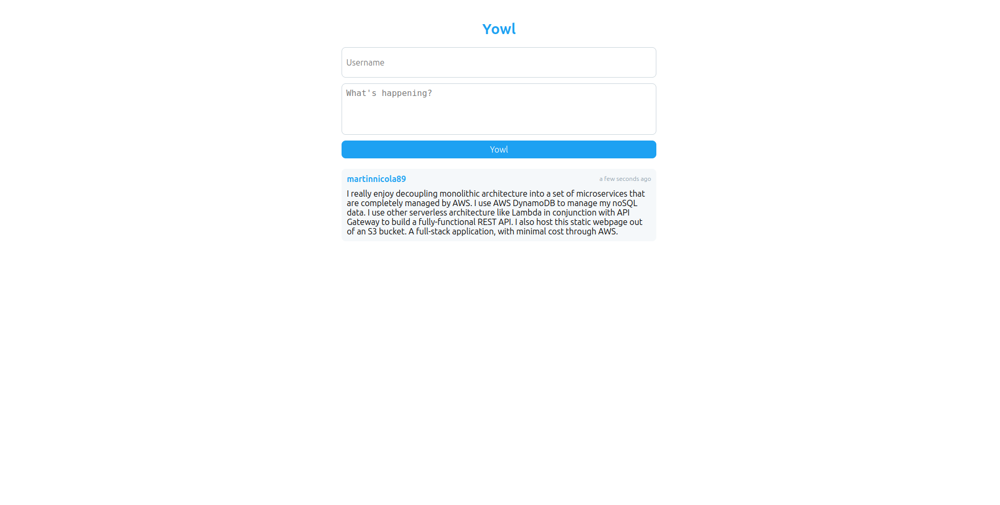

# Yowl: Your Ultimate Twitter-like Application

Yowl is a powerful Twitter-like application built on AWS cloud architecture, designed to enhance your **yowling** experience like never before. With Yowl, you can effortlessly read yowls from a vast database, as well as create new yowls to share your thoughts with the world.

Harnessing the scalability and flexibility of AWS, Yowl is fully decoupled, ensuring seamless performance and reliability. Whether you're an avid Twitter user or a developer looking to leverage the power of cloud technology, Yowl has got you covered.

Discover the freedom of accessing an extensive collection of yowls and effortlessly generate your own using Yowl's intuitive interface. Stay connected, express yourself, and elevate your Twitter game with Yowl, the ultimate Twitter-like application built for the cloud era.

Try Yowl today.

## Screenshots

## Technologies Used

- React.js
- AWS Lambda (Node.js environment)
- AWS API Gateway (Connects lambda functions to an endpoint)
- AWS S3 (static site hosting)
- AWS DynamoDB (noSQL key-value pair database)
- AWS IAM (established a user group with appropriate permissions to use AWS resources)

## Try it out

Yowl can be accessed [here](http://yowlmarty.s3-website.ca-central-1.amazonaws.com/).

## Future Work

- Implement **Amazon Cognito** to establish user login/signup.
- Add profile information to a user including **user photo upload**.
- Implement **hashtags** to sort data coming from DynamoDB.